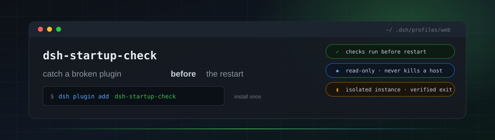
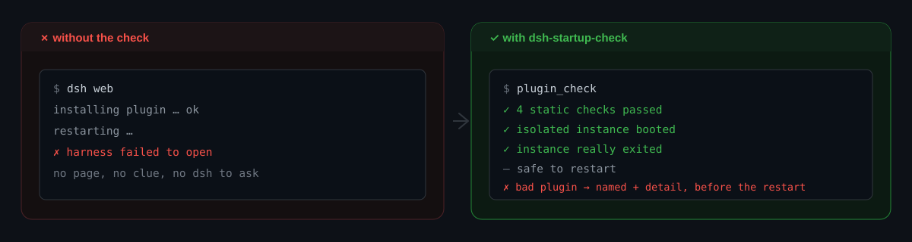

<div align="center">



# dsh-startup-check

**Catch a broken plugin _before_ the restart.**

*One tool — `plugin_check` — for the moment between "I installed a plugin" and "the harness won't open".*

[](https://github.com/cningan/dsh-startup-check/actions/workflows/ci.yml)
[](https://www.npmjs.com/package/dsh-startup-check)
[](package.json)
[](#requirements)
[](LICENSE)

[简体中文](README.zh.md) · **English**

</div>

---

## The problem

Every DSH plugin install is a leap of faith:

```text
install a plugin  →  restart  →  find out the hard way
```

When the leap fails you are left with a harness that will not open, no page to ask, and a
plugin tree you have to bisect by hand. By then the agent that could have read the code is
gone.

`plugin_check` moves that discovery **in front of** the restart: the model inspects the tree
— and, if you want, boots a real isolated instance to prove it comes up — while it can still
fix what it finds.

<div align="center">

</div>

## What a failure looks like

Broken syntax in one plugin, caught before any restart, with the file named:

```jsonc
// plugin_check { "target": "dsh-oauth" }
{
  "ok": false,
  "checks": [
    { "name": "语法检查", "ok": false,
      "detail": "dsh-oauth/lib/index.js: Unexpected token '}' (node --check exit 1)" },
    { "name": "package.json 结构", "ok": true, "detail": "1 个插件结构一致" },
    { "name": "配置树组装", "ok": true, "detail": "配置树组装成功 (162 行)" }
  ]
}
```

The model reads that, fixes the file, re-runs the check, and only then do you restart. When
the verdict is a real failure, the bundled **`plugin-fault-diagnosis`** skill takes over: read
the verdict → locate the file → classify the error → fix, disable, or roll back.

## What it checks

| # | Check | Catches |
|:-:|---|---|
| 1 | **Syntax** | a plugin `lib/*.js` that fails `node --check` (typos, TypeScript/JSX in a plain-JS plugin) |
| 2 | **Package structure** | missing `main` target, `dsh.client` declared without an `exports["./client"]` entry, wrong name prefix |
| 3 | **Patch references** | `cordis.patch.yml` pointing at a plugin directory that no longer exists |
| 4 | **Config-tree assembly** | `dsh --profile <p> --dump-config` failing — the loader cannot compose the tree at all |
| 5 | **Real-boot smoke** `live: true` | the isolated instance never prints its `dsh web: <url>` |
| 6 | **Page-side smoke** `page: true` | the page throws, logs errors, or renders nothing — client-side failures the host never sees |
| 7 | **Instance shutdown** *(with `live`)* | the isolated instance did **not** actually exit, verified against the process table |
| 8 | **Stray-instance audit** `sweep: true` | leftover smoke instances, plus a report of live hosts — **report only** unless you ask |

<div align="center">

**🛡️ Read-only by design**

It never restarts or touches the harness you are using.
Smoke instances run on `--port 0` with `--no-open` and a hard timeout;
cleanup kills **only** isolated smoke instances, by exact PID — a resident host is never killed.

</div>

## Install

```bash
dsh plugin --profile web add dsh-startup-check
```

Then **restart the harness** — installing a plugin changes `dsh.profile.bundles`, which is read
at boot. That is the last leap of faith you take.

```bash
plugin_check                          # static checks (fast)
plugin_check { live: true }           # + boot an isolated instance        (~12s)
plugin_check { page: true }           # + headless-browser page check      (~30–45s, implies live)
plugin_check { sweep: true }          # + audit live DSH processes         (~1–2s)
plugin_check { live: true, killStray: true }   # and clean up this run's leftovers
```

## Reading the verdict

- `ok: true` means **the checks that ran** passed. A static-only run says nothing about runtime
  behaviour; only `live` proves the tree boots.
- **"Not measured" is not "failed."** No browser, unreadable process table — the affected check
  says why and is treated as untested (`tested: false`) instead of being blamed on your plugins.
- Checks 1–3 walk `~/.dsh/profiles/web/plugins/**`, the `@local` layout. Plugins installed from
  npm into the profile's `node_modules` are covered by checks 4–8 instead.
- The profile is currently fixed to `web`; other profiles are open work.

## Requirements

| | |
|---|---|
| **Harness** | DeepSeek Harness with a `web` profile |
| **OS** | Windows — the instance audit uses PowerShell/WMI, the page half drives Edge/Chrome over CDP |
| **Node** | ≥ 22 (the harness's own engine) |
| **Browser** | Edge or Chrome, only if you want the page-side check |

## Development

```bash
git clone https://github.com/cningan/dsh-startup-check.git
cd dsh-startup-check
npm test
```

`npm test` runs `node --check` over every `lib/` file and then
[`test/tool-body-selftest.mjs`](test/tool-body-selftest.mjs), which drives `apply()` and the
tool's `execute()` in a fresh Node process against a stubbed context. That is the layer neither
`node --check` nor a boot smoke can see: a running harness keeps serving the code it booted
with, so a broken tool body stays green until the next restart.

Full design, per-object lifecycle and known limitations: [`docs/architecture.md`](docs/architecture.md).
Contributions welcome — see [`CONTRIBUTING.md`](CONTRIBUTING.md) and [`CHANGELOG.md`](CHANGELOG.md).

<div align="center">

**[MIT](LICENSE) © cningan** · built for [DeepSeek Harness](https://github.com/deepseek-ai/deepseek-harness)

</div>
